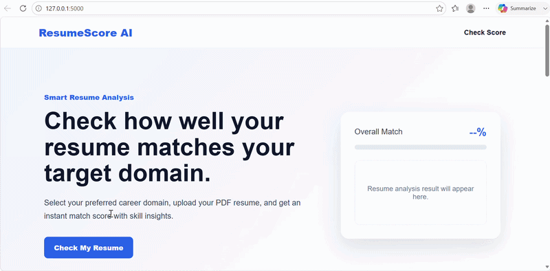

# 📄 ResumeScore AI

### AI-Powered Resume Screening System using Flask, NLP & Sentence Transformers

---

## 📌 About the Project

ResumeScore AI is an AI-powered resume screening application that evaluates resumes against domain-specific job descriptions using Natural Language Processing (NLP) and Sentence Transformers.

The application extracts text from PDF resumes, preprocesses the content, generates semantic embeddings, and computes cosine similarity to produce intelligent resume scores and skill-matching insights.

---

## 🚀 Features

- Upload resumes in PDF format
- Automatic resume text extraction
- Resume cleaning and preprocessing
- Domain-specific resume evaluation
- Semantic similarity using Sentence Transformers
- AI-powered resume scoring
- Skill matching and missing skill identification
- Interactive Flask web interface

---

## 📸 Application Preview

### 🎥 Demo



### 🏠 Home Page


### 📂 Domain Selection


### 📊 Resume Score


### 📈 Analysis Result


---

## 🛠 Tech Stack

| Category | Technologies |
|----------|--------------|
| Programming Language | Python |
| Web Framework | Flask |
| NLP | Sentence Transformers |
| Similarity Metric | Cosine Similarity |
| Data Processing | Pandas |
| PDF Processing | pdfplumber |
| Frontend | HTML, CSS |

---

## 🔄 Workflow

```text
Resume PDF
      │
      ▼
Extract Resume Text
      │
      ▼
Clean and Preprocess Text
      │
      ▼
Select Target Domain
      │
      ▼
Generate Sentence Embeddings
      │
      ▼
Calculate Cosine Similarity
      │
      ▼
Skill Matching
      │
      ▼
Generate Resume Score
      │
      ▼
Display Final Analysis
```

---

## 📂 Project Structure

```text
ResumeScore-AI/
│
├── app.py
├── README.md
├── requirements.txt
├── .gitignore
│
├── matching_engine/
│   ├── resume_extractor.py
│   └── sentence_transformer.py
│
├── requirements/
│   ├── Requirement.csv
│   └── requirements.py
│
├── static/
│   └── style.css
│
├── templates/
│   └── index.html
│
├── uploads/
│
└── screenshots/
    ├── home.png
    ├── domain.png
    ├── result.png
    ├── score.png
    └── Demo.gif
```

---

## ⚙ Installation

### Clone the repository

```bash
git clone https://github.com/Thanesh16/ResumeScore-AI.git
```

### Navigate to the project

```bash
cd ResumeScore-AI
```

### Install dependencies

```bash
pip install -r requirements.txt
```

### Run the application

```bash
python app.py
```

### Open in your browser

```text
http://127.0.0.1:5000
```

---

## 🔮 Future Enhancements

- ATS compatibility analysis
- Enhanced skill matching
- Resume improvement recommendations
- Multiple resume ranking
- Detailed skill-gap analysis
- LLM-powered resume feedback
- Cloud deployment

---

## 👨‍💻 Author

**Thanesh S**

Aspiring Data Scientist

[GitHub](https://github.com/Thanesh16)  
[LinkedIn](https://linkedin.com/in/thanesh006)

---

⭐ If you found this project useful, consider giving it a star.
