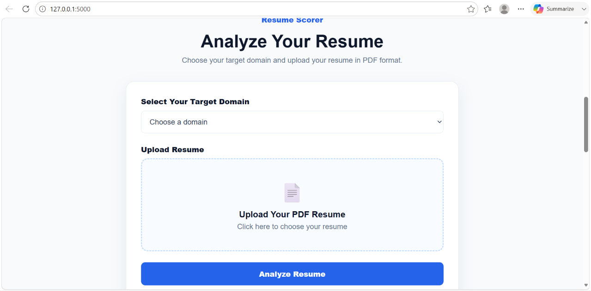
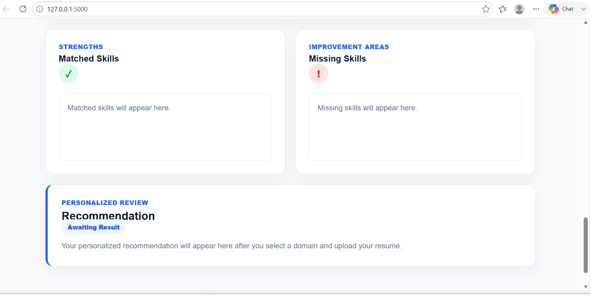
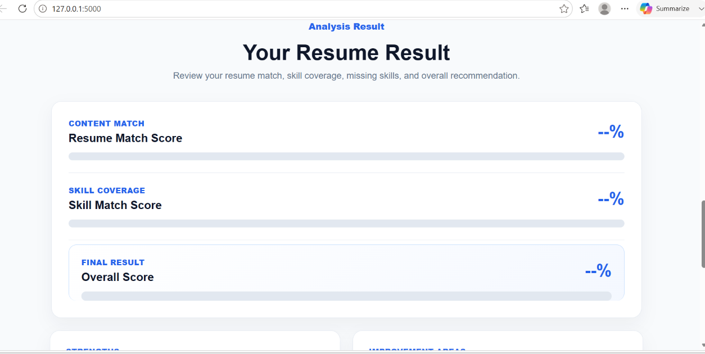

<div align="center">

# 📄 ResumeScore AI

### AI-Powered Resume Screening System using NLP and Sentence Transformers


</div>

---

## 📌 About the Project

ResumeScore AI is an intelligent resume-screening application that compares resumes with domain-specific job descriptions using Natural Language Processing and Sentence Transformers.

The application extracts text from PDF resumes, cleans the content, generates semantic embeddings, and calculates cosine similarity to produce an AI-based resume score.

---

## 🚀 Features

- Upload resumes in PDF format
- Automatic resume-text extraction
- Resume cleaning and preprocessing
- Domain-specific job matching
- Semantic comparison using Sentence Transformers
- Cosine-similarity-based resume scoring
- Flask-based web interface

---

## 🎥 Demo


---

## 📸 Screenshots

### Home Page


### Resume Upload


### Domain Selection



### Analysis Result



### Resume Score



---

## 🛠️ Tech Stack

| Category | Technologies |
|---|---|
| Programming Language | Python |
| Web Framework | Flask |
| NLP Model | Sentence Transformers |
| Similarity Method | Cosine Similarity |
| Data Processing | Pandas |
| PDF Extraction | pdfplumber |
| Frontend | HTML, CSS |

---

## 🔄 Workflow

```text
Resume PDF
    ↓
Text Extraction
    ↓
Text Cleaning
    ↓
Sentence Transformer
    ↓
Resume and Job Embeddings
    ↓
Cosine Similarity
    ↓
Resume Score
```

---

## 📂 Project Structure

```text
ResumeScore-AI/
│
├── app.py
├── matching_engine/
├── requirements/
├── static/
├── templates/
├── screenshots/
├── requirements.txt
├── README.md
├── .gitignore
└── LICENSE
```

---

## ⚙️ Installation

### 1. Clone the repository

```bash
git clone https://github.com/Thanesh16/ResumeScore-AI.git
```

### 2. Open the project folder

```bash
cd ResumeScore-AI
```

### 3. Install the dependencies

```bash
pip install -r requirements.txt
```

### 4. Run the application

```bash
python app.py
```

### 5. Open the application

```text
http://127.0.0.1:5000
```

---

## 🔮 Future Enhancements

- ATS compatibility score
- Required-skills matching
- Missing-skills identification
- Resume improvement suggestions
- Multiple-resume ranking
- LLM-based resume feedback
- Cloud deployment

---

## 👨‍💻 Author

**Thanesh S**

Aspiring Data Scientist

[GitHub](https://github.com/Thanesh16) • [LinkedIn](https://linkedin.com/in/thanesh006)

---

⭐ If you found this project useful, consider starring the repository.
